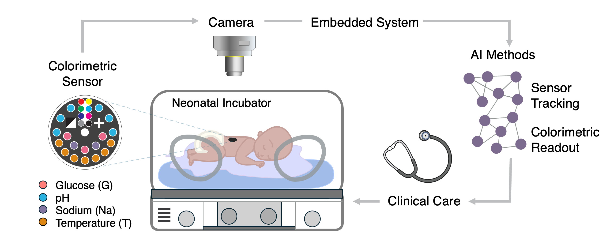
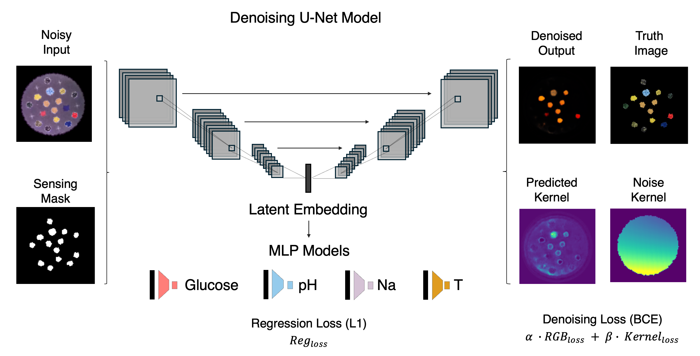

Biofluid Colorimetric Sensors
==============================

We designed a noninvasive, wearable and miniaturized paper sensor patch capturing critical body functions via colorimetric analysis of body fluids (perspiration and saliva) adapted to the clinical needs of neonatal monitoring. 
The colorimetric sensor facilitates simultaneous real-time tracking of multiple biomarkers under clinically relevant conditions using deep learning models for automated sensor detection and parameter estimation.

A denoising deep learning architecture based on the U-Net was developed for automated estimation of the colorimetric sensor response, accounting for realistic conditions such as variable perspectives, sensor shear deformation, rotation, and non-uniform illumination across the sensor surface. 
The U-Net-based module denoises the image and corrects illumination artefacts, while a multi-layer perceptron (MLP) module is jointly trained to do regression of the target parameter values based on the corrected latent representation of the sensor.

Preprint of this work can be found at https://www.medrxiv.org/content/10.1101/2025.09.21.25336258v1

Project Organization
------------
### **1. Models**

── 1.1 [Denoising U-Net MLP Model](./src/models/model_denoising_unet_mlp_25.py)

── 1.2 [Baseline Model: CNN MLP](./src/models/model_cnn_mlp.py)

── 1.3 [Baseline Model: Curve Fitting](./src/models/curve%20fitting%20models/curve_fitting_models.py)

### **2. Data**

── 2.1 [Dataloader Sensor With Noise](./src/data/data_loader_autoencoder_noise.py)

── 2.2 [Sensor Image Generation](./src/data/make_synthetic_sensor.py)

── 2.3 [Non-Uniform-Illumination Kernels](./src/data/light_kernels.py)

### **3. Train/Test Scripts**

── 3.1 [Train Denoising U-Net](./src/train/denoise_unet_mlp_25/train_unet_mlp_25.py)

── 3.2 [Test Denoising U-Net](./src/test/denoise_unet_mlp_25/evaluate_unet_mlp_25.py)

── 3.3 [Train Baseline](./src/train/single_var_prediction/train_single_model.py)

── 3.4 [Test Baseline](./src/test/single_var_prediciton/evaluate.py)

------------

## Dataset and Models
> The datasets for this publication are available in Zenodo: https://doi.org/10.5281/zenodo.18660324
>
> The data provided here contains:
> - Sensor Characterization Raw Data: Experimental images and dataframes with the pixel color distributions for every variable (ph, temperature, sodium, glucose).
> - Sensor Skeleton Images: Images of the Sensor skeletons for data augmentation.
> - AI model prediction results dataframes: Dataframes of the AI model predictions for different levels of noise.
> - Results Pilot Experiment: Dataframes with results for pilot experiment.
> - Pilot experiment saliva sweat raw sensor images: Images and experimental color distributions of the sensors for pilot experiment.
> 

> Download the pre-trained denoising U-Net models in Zenodo:
> 
> https://doi.org/10.5281/zenodo.18659968
> 

## Reference
> Wireless Colorimetric Multi-Biomarker Sensing to Enable Critical Neonatal Monitoring.
> 
> Alejandra Castelblanco, Elisabetta Ruggeri, Giusy Matzeu, Motaharehsadat Heydarian, Kai Foerster, Ahmed Bahnasy, Andreas Flemmer, Julia A. Schnabel, Benjamin Schubert, Fiorenzo G. Omenetto, Anne Hilgendorff
>
> medRxiv 2025.09.21.25336258; doi: https://doi.org/10.1101/2025.09.21.25336258
